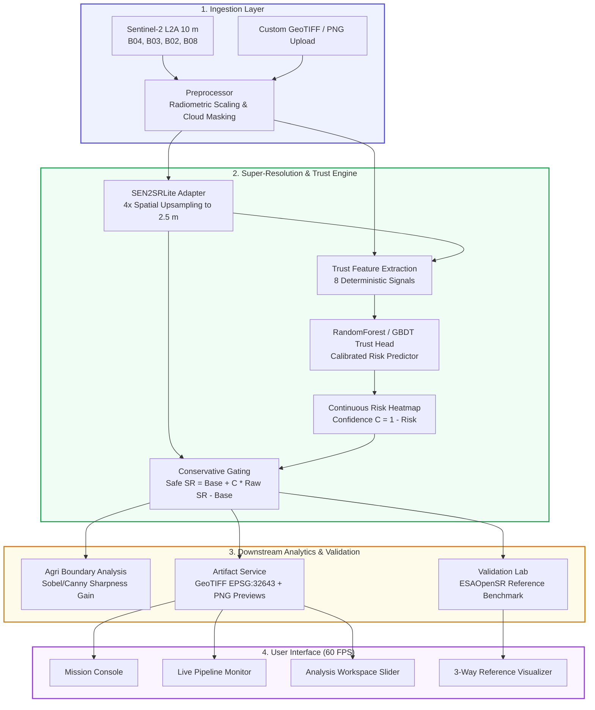

<div align="center">

# 🛰️ Spectra SR
### Deep Learning Satellite Super-Resolution (10 m → 2.5 m) & Autonomous Trust Engine

[](https://spectra-sr.onrender.com/)
[](https://spectra-sr.onrender.com/)
[](https://www.python.org/)
[](https://fastapi.tiangolo.com/)
[](https://www.docker.com/)
[](LICENSE)

<br>

**[🚀 Launch Live Application](https://spectra-sr.onrender.com/)** • **[📖 System Architecture](#-architecture--pipeline-flow)** • **[🛡️ Trust Engine & Safe-SR](#-the-trust-engine--safe-sr-gating)** • **[⚡ Quickstart](#-quickstart--local-setup)** • **[📡 API Docs](#-rest-api-reference)**

<br>

> **Transforming Sentinel-2 10 m multi-spectral imagery into 2.5 m super-resolved rasters with self-supervised hallucination detection, continuous pixel-level reliability maps, and conservative trust-gating.**

</div>

---

### 🌐 Live Production Deployment

| Service | Endpoint / Link | Status |
| :--- | :--- | :--- |
| **Interactive Web Application** | **[https://spectra-sr.onrender.com/](https://spectra-sr.onrender.com/)** |  |
| **REST API OpenAPI Docs** | **[https://spectra-sr.onrender.com/docs](https://spectra-sr.onrender.com/docs)** |  |
| **Production Health Check** | **[https://spectra-sr.onrender.com/api/v1/health](https://spectra-sr.onrender.com/api/v1/health)** |  |

*Zero configuration required — browse active Indian agricultural AOIs, run the 4× super-resolution pipeline, drag the interactive split slider, and inspect the validation scorecard instantly.*

---

## 📌 Executive Summary & Problem Statement

**Smart India Hackathon (SIH) 2026 — Problem Statement 26142:**
> *"Deep Learning Based Super Resolution Mapping (SRM) from Medium Resolution Satellite Imageries"*

### The Satellite Super-Resolution Paradox
While contemporary deep generative architectures (GANs, diffusion backbones) produce aesthetically sharp 4× upsampled imagery, they present an unacceptable risk for mission-critical Earth Observation: **scientific hallucination**. Pure generative models synthesize plausible high-frequency textures (false roads, fictitious crop lines, artificial waterways) that have no basis in physical ground truth.

### The Spectra SR Solution
**Spectra SR** solves this through a dual-engine paradigm:
1. **SEN2SRLite Adapter:** Delivers continuous 4× spatial upsampling ($10\text{ m} \to 2.5\text{ m}$ GSD) across Sentinel-2 L2A RGB+NIR channels (`B04`, `B03`, `B02`, `B08`).
2. **Autonomous Trust Engine:** Extracts 8 live deterministic physical and spectral consistency signals to generate a continuous $[0, 1]$ risk heatmap and applies **conservative Trust-Gating**:
   $$\mathbf{SR}_{\text{safe}} = \mathbf{LR}_{\text{base}} + \mathbf{C} \odot (\mathbf{SR}_{\text{raw}} - \mathbf{LR}_{\text{base}})$$
   Where $\mathbf{C} = 1 - \mathbf{Risk}$ is pixel-wise learned confidence. Where risk is elevated, the system gracefully falls back to the conservative spectral baseline, preventing false positive inferences in agronomic mapping and land administration.

---

## 🌟 Key Features & Innovations

| Capability | Description |
| :--- | :--- |
| **🛰️ 4× Spatial Super-Resolution** | Upsamples $10\text{ m}$ Sentinel-2 L2A observations to $2.5\text{ m}$ Ground Sample Distance (GSD) preserving radiometric fidelity and multi-spectral coherence. |
| **🛡️ 8-Signal Trust Engine** | Live feature extraction measuring Spectral Angle Distance (SAD), sub-pixel phase correlation shift, NDVI drift, gradient energy delta, and local variance. |
| **🔒 Conservative Trust-Gating** | Generates two distinct rasters: **Raw SR** (maximum generative detail) and **Safe SR** (trust-gated, ensuring hallucination-free land parcel analysis). |
| **🌾 Agricultural Field Boundary Utility** | Evaluates boundary clarity gain (typically $+35\%$ to $+45\%$ gradient enhancement) with legal cadastral non-survey disclaimers. |
| **📊 Scientific Validation Lab** | Evaluates outputs against ESAOpenSR reference protocols: **Hallucination Rate** ($<30\%$), **Omission Rate** ($<30\%$), **Improvement Gain** ($>15\%$), and **Structural Synthesis** ($>0.40$). |
| **🎚️ 60 FPS Split Comparison Slider** | Hardware-accelerated CSS `clip-path` viewer comparing $10\text{ m}$ LR vs $2.5\text{ m}$ SR and reconstructed edges vs Ground Truth HR. |
| **🇮🇳 Curated Indian Agrarian AOIs** | Calibrated offline presets across Maharashtra (Pune peri-urban), Punjab (Ludhiana crops), Karnataka (Raichur dryland), and Haryana (Karnal basin). |
| **📤 Custom Image & GeoTIFF Ingestion** | Drag-and-drop ingestion of custom user satellite images or GeoTIFFs with automatic band harmonization and on-demand super-resolution. |

---

## 🏗️ Architecture & Pipeline Flow



---

## 🧮 Mathematical Formulations

### 1. Conservative Trust-Gating Formula
$$\mathbf{SR}_{\text{safe}}(x, y) = \mathbf{LR}_{\text{bicubic}}(x, y) + \mathbf{C}(x, y) \cdot \left(\mathbf{SR}_{\text{raw}}(x, y) - \mathbf{LR}_{\text{bicubic}}(x, y)\right)$$
Where:
- $\mathbf{C}(x, y) = 1.0 - \mathbf{Risk}(x, y) \in [0, 1]$
- If $\mathbf{Risk} \to 1$ (high hallucination likelihood), $\mathbf{SR}_{\text{safe}} \to \mathbf{LR}_{\text{bicubic}}$ (zero hallucination risk).
- If $\mathbf{Risk} \to 0$ (high spectral & structural consistency), $\mathbf{SR}_{\text{safe}} \to \mathbf{SR}_{\text{raw}}$ (full 2.5 m resolution).

### 2. Spectral Angle Distance (SAD)
$$\theta_{\text{SAD}}(\mathbf{v}_{\text{sr}}, \mathbf{v}_{\text{lr}}) = \arccos\left(\frac{\mathbf{v}_{\text{sr}} \cdot \mathbf{v}_{\text{lr}}}{\|\mathbf{v}_{\text{sr}}\|_2 \|\mathbf{v}_{\text{lr}}\|_2}\right) \cdot \frac{180}{\pi}$$
Measures physical reflectance vector drift across bands; values under $5.0^\circ$ indicate strict radiometric conservation.

### 3. High-Frequency Improvement Gain
$$\text{Improvement Gain} = \frac{\sum \|\nabla \mathbf{SR}\| - \sum \|\nabla \mathbf{LR}_{\text{up}}\|}{\sum \|\nabla \mathbf{LR}_{\text{up}}\| + \epsilon} \times 100\%$$
Quantifies the genuine structural frequency enrichment restored by 4× super-resolution over simple bicubic interpolation.

---

## 🖥️ Application Modules & User Workflow

```
┌─────────────────────────────────────────────────────────────────────────────┐
│  Spectra SR (SIH 2026 PS 26142)                         [ GPU: RTX 4060 ]   │
│  [1. Mission Console]  [2. Pipeline Monitor]  [3. Analysis]  [4. Lab]       │
└─────────────────────────────────────────────────────────────────────────────┘
```

### 1. Mission Console
- Interactive AOI selector covering Indian agro-ecological zones:
  - **Pune Peri-Urban Farmland (Maharashtra):** Smallholder parcels, arterial roads, crop vigor.
  - **Punjab Intensive Cropland (Ludhiana):** Canal irrigation grids, intensive wheat/rice fields.
  - **Karnataka Semiarid Farmland (Raichur):** Rainfed crop fields, soil-vegetation contrasts.
  - **Haryana Agricultural Basin (Karnal):** High-density agricultural basin.
  - **Western Ghats Agro-Forestry (Nashik):** High-relief terrain and orchard parcels.
- Custom Satellite Image / GeoTIFF drag-and-drop ingestion with automatic preprocessing.
- Configurable inference parameters: Target GSD ($2.5\text{ m}$), Window Overlap ($16\text{ px}$), Trust-Gating toggle.

### 2. Live Pipeline Monitor
- Real-time 8-stage progress tracker:
  1. *Scene Ingestion & Discovery*
  2. *Radiometric Calibration & Preprocessing*
  3. *SEN2SRLite Super-Resolution Model Inference*
  4. *Multi-Spectral Trust Feature Extraction*
  5. *Trust Head Probability & Risk Heatmap Inference*
  6. *Conservative Trust-Gated Recombination*
  7. *Agricultural Field Boundary Evaluation*
  8. *GeoTIFF Spatial Raster Packaging & Archiving*

### 3. Analysis Workspace & Split Slider
- **Draggable 60 FPS Split Slider:** Instant before-and-after comparison between $10\text{ m}$ observed Sentinel-2 and $2.5\text{ m}$ super-resolved imagery.
- **Layer Switcher:**
  - `Raw SR (2.5m)`: Unconstrained deep learning output.
  - `Safe SR (2.5m)`: Trust-gated safe output.
  - `Predicted Risk Heatmap`: Color-mapped continuous risk ($0 \to 1$).
  - `Field Boundaries`: Gradient-enhanced field parcel demarcations.
- **Trust Scorecard:** Live quantitative audit displaying Spectral Drift ($^\circ\text{SAD}$), Spatial Shift ($\text{px}$), Consistency ($\text{RMSE}$), and Risk Level (`LOW` / `MEDIUM` / `HIGH`).
- **GeoTIFF Downloads:** Download full multi-band GeoTIFFs preserving geospatial metadata (`EPSG:32643`, $2.5\text{ m}$ pixel scale).

### 4. Scientific Validation Lab
- Independent evaluation against paired High-Resolution (HR) Ground Truth imagery from official ESAOpenSR protocols:
  - **Hallucination Rate:** Percentage of high frequencies in SR absent in HR (Calibrated Goal: $<30.0\%$).
  - **Omission Rate:** Real HR features missed by the SR model (Calibrated Goal: $<30.0\%$).
  - **Improvement Gain:** Fidelity & sharpness gain over 10 m baseline (Calibrated Goal: $>15.0\%$).
  - **Structural Synthesis:** Ratio of realistic spatial frequency energy (Calibrated Goal: $>0.40$).
- Mode toggle: Switch seamlessly between **3-Way Multi-Pane** view and **SR vs HR Split Slider**.

---

## ⚡ Quickstart & Local Setup

### Prerequisites
- Python 3.10, 3.11, or 3.12
- Git
- *(Optional)* NVIDIA GPU with CUDA for hardware acceleration (CPU execution is fully supported out of the box).

### 1. Clone the Repository
```bash
git clone https://github.com/himanshu-jadhav108/Spectra-SR-.git
cd Spectra-SR-
```

### 2. Create and Activate Virtual Environment
```bash
# On Linux / macOS
python3 -m venv .venv
source .venv/bin/activate

# On Windows (PowerShell)
py -m venv .venv
.venv\Scripts\Activate.ps1
```

### 3. Install Dependencies
```bash
pip install --upgrade pip
pip install -r requirements.txt
```

### 4. Run Pre-flight Audit & Tests
```bash
# Execute automated unit and pipeline tests
pytest tests/ -v

# Run the 15-check production readiness audit
python tests/audit_production.py
```

### 5. Launch the Local Server
```bash
uvicorn backend.app.main:app --host 0.0.0.0 --port 8000 --reload
```
Open **[http://localhost:8000](http://localhost:8000)** in your browser.

---

## 🐳 Docker Deployment

The application includes a production multi-stage Docker build optimized for low memory footprint and dynamic cloud port bindings:

```bash
# Build Docker image
docker build -t spectra-sr:latest .

# Run container locally
docker run -p 8000:8000 --name spectra-sr-app spectra-sr:latest
```

Or using Docker Compose:
```bash
docker-compose up --build -d
```
Access the application at `http://localhost:8000`.

---

## 📡 REST API Reference

The backend exposes a fully typed, auto-documented OpenAPI specification accessible at `/docs` or `/redoc`:

| Method | Endpoint | Description |
| :--- | :--- | :--- |
| `GET` | `/api/v1/health` | System health check, GPU status, active environment. |
| `GET` | `/api/v1/scenes` | List all discovered Sentinel-2 scenes (Indian AOIs & custom). |
| `GET` | `/api/v1/scenes/{scene_id}/preview` | Fetch PNG preview of a low-resolution scene. |
| `POST` | `/api/v1/scenes/upload` | Upload a custom GeoTIFF or satellite image for processing. |
| `POST` | `/api/v1/jobs` | Submit a 4× super-resolution job with configurable trust gating. |
| `GET` | `/api/v1/jobs/{job_id}` | Poll asynchronous job status, current step, and progress percentage. |
| `GET` | `/api/v1/jobs/{job_id}/result` | Retrieve full job result, Trust Scorecard, and artifact paths. |
| `GET` | `/api/v1/artifacts/{job_id}/{filename}` | Download GeoTIFF rasters (`2.5m_safe_sr.tif`) or PNG previews. |
| `GET` | `/api/v1/benchmark/datasets` | List available paired HR reference benchmark datasets. |
| `POST` | `/api/v1/benchmark/run` | Execute ESAOpenSR reference validation and return metrics. |

---

## 📂 Project Structure

```
Spectra_SR_Antigravity_MVP/
├── backend/
│   ├── app/
│   │   ├── api/                 # FastAPI REST routing (jobs, scenes, benchmark)
│   │   ├── core/                # Configuration settings, logging, custom exceptions
│   │   ├── db/                  # SQLite schema, migrations, connection management
│   │   ├── geo/                 # Geospatial raster I/O, GeoTIFF creation, CRS metadata
│   │   ├── schemas/             # Pydantic v2 request/response contracts
│   │   ├── services/            # SR engine adapter, CDSE STAC client, job runner
│   │   └── trust/               # 8-signal feature extraction, Trust Head, gating logic
│   └── main.py                  # App entry point, SPA static mounting, middleware
├── frontend/
│   ├── index.html               # Semantic HTML5 single-page application
│   ├── style.css                # Pure CSS3 design system, dark palette, 60fps animations
│   ├── app.js                   # State manager, pointer capture split slider, REST client
│   └── public/brand/            # High-resolution logos and visual assets
├── contracts/                   # Canonical openapi.yaml specification
├── data/benchmark/              # Calibrated ESAOpenSR reference chips & HR pairs
├── tests/                       # Unit tests, integration tests, production pre-flight audit
├── Dockerfile                   # Headless production container specification
├── docker-compose.yml           # Multi-container orchestration
├── render.yaml                  # Render.com Blueprint configuration
└── requirements.txt             # Pinned production Python dependencies
```

---

## 🔬 Scientific Citation & Governance

### Scientific Boundary
> **Essential Scientific Caveat:** Spectra SR distinguishes strictly between **predicted reliability** (computed during live inference on single 10 m observations) and **empirical ground-truth validation** (computed only in the Validation Lab where verified high-resolution ground truth exists). Reconstructed agricultural field boundaries are designed exclusively for agronomic farm management and crop health monitoring; they do not constitute legal land title or cadastral survey proof.

### Acknowledgments & References
- **ESA OpenSR Organization:** [https://github.com/ESAOpenSR](https://github.com/ESAOpenSR)
- **Aybar et al. (2024):** *OpenSR-test: A comprehensive benchmark dataset and suite for satellite super-resolution.*
- **Copernicus Data Space Ecosystem (CDSE):** [https://dataspace.copernicus.eu/](https://dataspace.copernicus.eu/)
- **European Space Agency (ESA):** Sentinel-2 Multi-Spectral Instrument (MSI) mission.

---

<div align="center">

**Developed for Smart India Hackathon (SIH) 2026 — PS 26142**  
*Built with ❤️ for precision agriculture, Earth Observation, and trustworthy AI.*

[](https://spectra-sr.onrender.com/)

</div>
